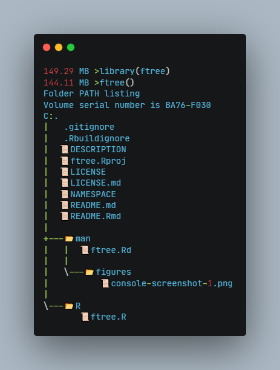

<!-- README.md is generated from README.Rmd. Please edit that file -->

```{r, include = FALSE}
knitr::opts_chunk$set(
  collapse = TRUE,
  comment = "#>",
  fig.path = "man/figures/README-",
  out.width = "100%"
)
```

# ftree

<!-- badges: start -->
[](https://lifecycle.r-lib.org/articles/stages.html#experimental)
<!-- badges: end -->

ftree is an experimental and mostly useless R package. It has one function, `ftree()` that shows a file tree on your console.

## Unix

Unicode doesn't quite work correctly..

```{r example}
## this doesn't render in Github Markdown
library(ftree)
ftree(path = system.file(package = "ftree"))
```


or render with no emoji
```{r example2}
## note this should be equivalent to fs::dir_tree()
ftree(path = system.file(package = "ftree"), unicode = FALSE)
```


## Windows

Note that unicode rendering this doesn't seem to work well when with rmarkdown in Windows. However, it should display fine in the console. 

```{r console, echo=FALSE, out.width="50%"}

```


`r Sys.time()`
